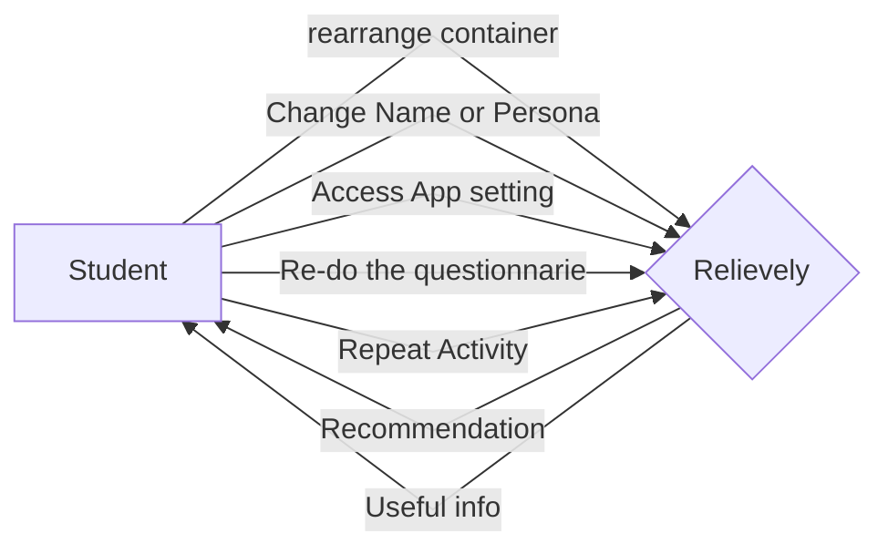

```mermaid
%%{ init: { 'flowchart': { 'curve': 'linear' } } }%%
graph LR
    A[Student] -->|rearrange container| B{Relievely}
    B --> |Recommendation| A
    A --> |Change Name or Persona| B
    A --> |Access App setting| B
    B --> |Useful info| A
    A --> |Re-do the questionnarie| B
    A --> |Repeat Activity| B
```