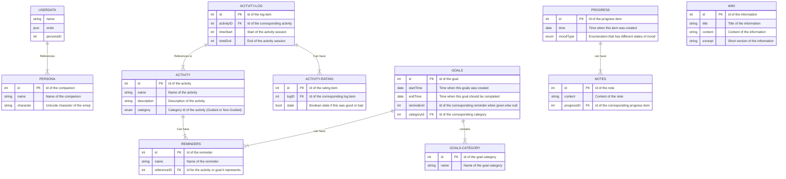

```mermaid
erDiagram
    PERSONA {
        int id PK "Id of the companion"
        string name "Name of the companion"
        string character "Unicode character of the emoji"
    }
    USERDATA {
        string name
        json order
        int personaID
    }
    USERDATA || -- |{ PERSONA : "References"
    
    ACTIVITY {
        int id PK "Id of the activity"
        string name "Name of the activity"
        string description "Description of the activity"
        enum category "Category Id of the activity (Guided or Non-Guided)"
    }
    ACTIVITY || -- |{ REMINDERS : "Can have"

    ACITVITY-LOG {
        int id PK "Id of the log item"
        int activityID FK "Id of the corresponding activity"
        int timeStart "Start of the activity session"
        int timeEnd "End of the activity session"
    }
    ACITVITY-LOG || -- |{ ACTIVITY : "References to"
    ACITVITY-LOG || -- |{ ACTIVITY-RATING : "Can have"

    ACTIVITY-RATING {
        int id PK "Id of the rating item"
        int logID FK "Id of the corresponding log item"
        bool state "Boolean state if this was good or bad"
    }

    GOALS {
        int id PK "Id of the goal"
        date startTime "Time when this goals was created"
        date endTime "Time when this goal should be completed"
        int reminderId "Id of the corresponding reminder when given else null"
        int categoryId FK "Id of the corresponding category"
    }
    GOALS || -- |{ GOALS-CATEGORY : contains
    GOALS-CATEGORY {
        int id PK "Id of the goal category"
        string name "Name of the goal category"
    }
    GOALS || -- |{ REMINDERS : "can have"

    REMINDERS {
        int id PK "Id of the reminder"
        string name "Name of the reminder"
        int referenceID FK "Id for the activity or goal it represents"
    }

    PROGRESS {
        int id PK "Id of the progress item"
        date time "Time when this item was created"
        enum moodType "Enumeration that has different states of mood"
    }
    NOTES {
        int id PK "Id of the note"
        string content "Content of the note"
        int progressID FK "Id of the corresponding progress item"
    }
    PROGRESS || -- |{ NOTES : "can have"

    WIKI {
        int id PK "Id of the information"
        string title "Title of the information"
        string content "Content of the information"
        string excerpt "Short version of the information"
    }
```
