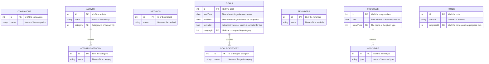

```mermaid
erDiagram
    COMPANIONS {
        int id PK "Id of the companion"
        string name "Name of the companion"
    }

    ACTIVITY {
        int id PK "Id of the activity"
        string name "Name of the activity"
        int category FK "Category Id of the activity"
    }
    ACTIVITY || -- |{ ACTIVITY-CATEGORY : contains
    ACTIVITY-CATEGORY {
        int id PK "Id of the category"
        string name "Name of the category"
    }

    METHODS {
        int id PK "Id of the method"
        string name "Name of the method"
    }

    GOALS {
        int id PK "Id of the goal"
        date startTime "Time when this goals was created"
        date endTime "Time when this goal should be completed"
        bool reminder "Indicator if the user want's a reminder for this"
        int categoryId FK "Id of the corresponding category"
    }
    GOALS || -- |{ GOALS-CATEGORY : contains
    GOALS-CATEGORY {
        int id PK "Id of the goal category"
        string name "Name of the goal category"
    }

    REMINDERS {
        int id PK "Id of the reminder"
        string name "Name of the reminder"
    }

    PROGRESS {
        int id PK "Id of the progress item"
        date time "Time when this item was created"
        int moodType FK "The name of the given type"
    }
    PROGRESS || -- |{ MOOD-TYPE : contains
    MOOD-TYPE {
        int id PK "Id of the mood type"
        string type "Name of the mood type"
    }

    NOTES {
        int id PK "Id of the note"
        string content "Content of the note"
        int progressID FK "Id of the corresponding progress item"
    }
```