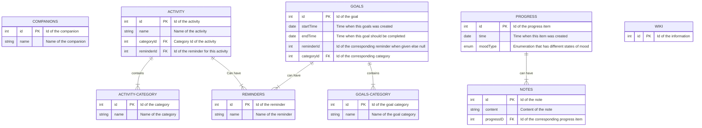

```mermaid
erDiagram
    COMPANIONS {
        int id PK "Id of the companion"
        string name "Name of the companion"
    }
    
    ACTIVITY {
        int id PK "Id of the activity"
        string name "Name of the activity"
        int categoryId FK "Category Id of the activity"
        int reminderId FK "Id of the reminder for this activity"
    }
    ACTIVITY || -- |{ ACTIVITY-CATEGORY : contains
    ACTIVITY || -- |{ REMINDERS : "Can have"


    ACTIVITY-CATEGORY {
        int id PK "Id of the category"
        string name "Name of the category"
    }

    GOALS {
        int id PK "Id of the goal"
        date startTime "Time when this goals was created"
        date endTime "Time when this goal should be completed"
        int reminderId "Id of the corresponding reminder when given else null"
        int categoryId FK "Id of the corresponding category"
    }
    GOALS || -- |{ GOALS-CATEGORY : contains
    GOALS-CATEGORY {
        int id PK "Id of the goal category"
        string name "Name of the goal category"
    }
    GOALS || -- |{ REMINDERS : "can have"

    REMINDERS {
        int id PK "Id of the reminder"
        string name "Name of the reminder"
    }

    PROGRESS {
        int id PK "Id of the progress item"
        date time "Time when this item was created"
        enum moodType "Enumeration that has different states of mood"
    }
    NOTES {
        int id PK "Id of the note"
        string content "Content of the note"
        int progressID FK "Id of the corresponding progress item"
    }
    PROGRESS || -- |{ NOTES : "can have"

    WIKI {
        int id PK "Id of the information"
    }
```
